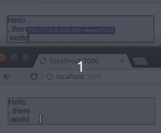

# Rich - WORK IN PROGRESS

A decentralized collaborative rich text editor powered by DOM mutations, CRDT, and WebRTC

## Installation

`yarn add @mattkrick/rich`

## What is it

A collaborative rich text editor like google docs (without the google).

## How's it different?

Rich is different in 3 ways: DOM Mutations, CRDTs, and WebRTC

### Dom Mutations
Every other `contenteditable` editor out there is _really_ smart. 
Rich doesn't compete by being smarter.
It competes by being dumber. 
A _lot_ dumber. 

For example, all other editors create their own proprietary schema.
The advanced ones even let you customize that schema!
Rich just uses the DOM schema.

To manage updates, other editors work by overriding the default content editable behavior.
For example, when you hit backspace, they'll intercept that `keydown` event, 
decide if they should remove a character or a whole line, 
and execute an operation to do that.
When that strategy fails (e.g. iOS spellcheck, android IME autosuggest) 
they have special handling for `input`/`beforeInput`/`onComposition` events. 
This can limit advanced functionality, such as maintaining autocorrect suggestions.

Rich has no special handling for different browsers or devices. 
It just serializes the DOM & shares it.
It's really that dumb. 
By focusing on what you see instead of how to achieve it, it can handle edge cases without trying. 
For example, some phones have a shake-your-phone-to-delete-a-word command. 
Rich doesn't need special handling to support that.
Being dumb also makes it smaller, faster, and easier to PR.

### CRDTs

"Last-write wins" isn't good enough for collaborative editors. To handle merge conflicts, there are 2 competing technologies: OTs and CRDTs.
OTs require special handling for each & every command, so they are more error prone and adding features is a huge undertaking.
CRDTs are simpler, at the expense of being more memory-intensive, which is usually an acceptable trade-off.
All other collaborative rich-text editors use OTs because before recently, document-based CRDTs didn't exist.
[Automerge](https://github.com/automerge/automerge) changed that.
Rich just serializes the DOM to JSON and lets Automerge handle the conflict merging.

### WebRTC

The largest benefit of CRDTs is that they don't require a centralized server to merge conflicts.
In an age of oversight and censorship by governments, ISPs, and corporations, the world needs an internet where peers can connect directly.
WebRTC provides the framework for such a vision; but without useful tools that use the WebRTC framework, the vision isn't realized.
Rich aims to be just one of the many tools necessary to make a decentralized internet a reality.
By using the WebRTC connector, developers can reduce server throughput, decrease latency between peers, and create a better internet for all.
Of course Rich also works just as well using a centralized server, if you don't mind the increased data throughput, latency, and the occasional MITM attack.

## Usage

See the playground or run `yarn dev`.
Open it in 2 browsers to test the collaborative editing.
Introduce a lag in sending changes to _really_ test the collaborative editing

## API

- `<Editor/>`: The primary component with the following properties
  - `doc`: The document, including the content, local selection range, and the selection ranges of connected peers
  - `onChange(doc)`: a callback that fires whenever you change the content or your caret position

- `RichContent.fromRaw`: a function that rehydrates your saved content
- `RichContent.fromText`: a function that turns a string of text into new content
- `RichContent.fromJSON`: a function that turns a serialized DOM into a Rich document

## Example

For the simplest example, see `App.tsx` in the playground folder

## License

MIT
